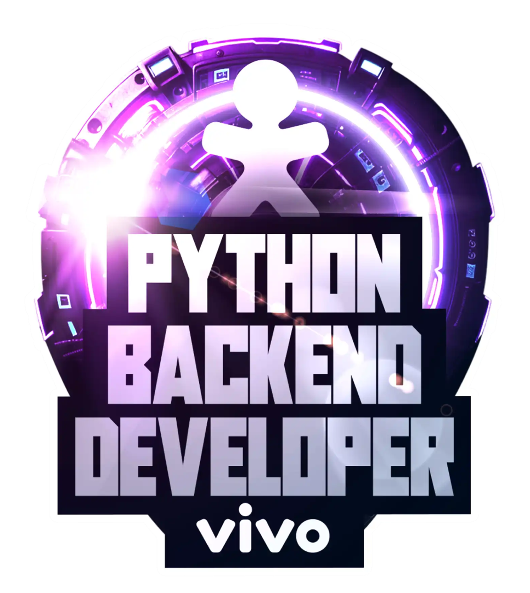

# **Bootcamp Python AI Backend Developer**

Este projeto foi desenvolvido através do Bootcamp Python AI Backend Developer, oferecido pela plataforma [Digital Innovation One](https://www.dio.me/) em parceria com a [Vivo](https://vivo.com.br/).

O objetivo do bootcamp **"Coding The Future Vivo - Python AI Backend Developer"** é iniciar  em desenvolvimento back-end com Python.

O foco principal do bootcamp:

**Aprender a linguagem Python:**

* Funções de Python com estrutura de dados.
* Conceitos importantes de orientação a
  objetos (POO).

**Integrar o conhecimento com frameworks:**

* Fast API.
* LangChain.

**Aprofundar o desenvolvimento web:**

* Construindo APIs.
* Utilizando a metodologia de testes
  unitários com TDD.

## **Projetos**

### [LAB-01: Sistema Bancário Simples com Python](./projects/LAB-01/README.md)

### [LAB-02: Otimizando o Sistema Bancário com Funções Python](./projects/LAB-02/README.md)

### [LAB-03: Modelando o Sistema Bancário em POO com Python](./projects/LAB-03/README.md)
