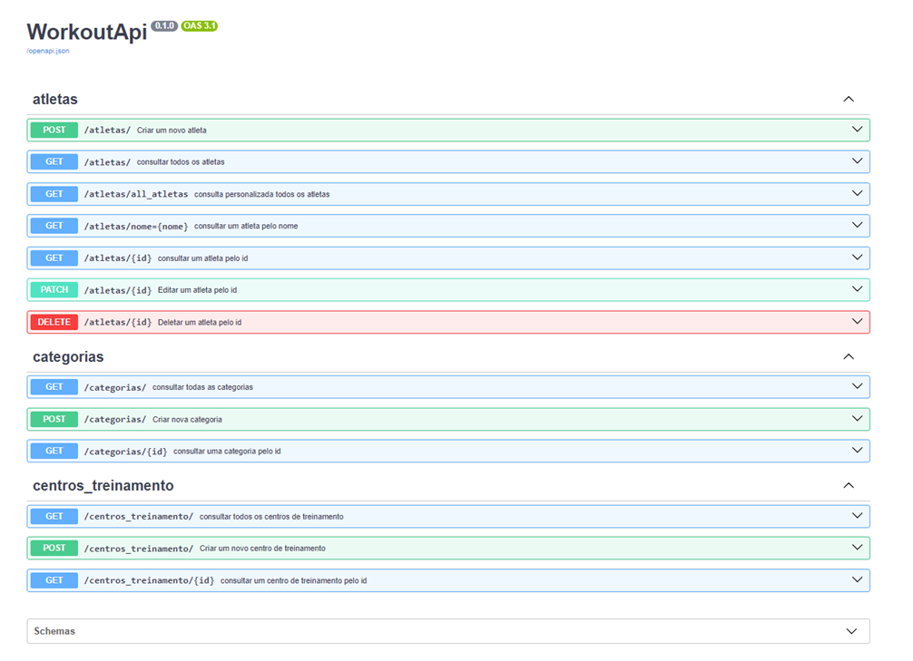
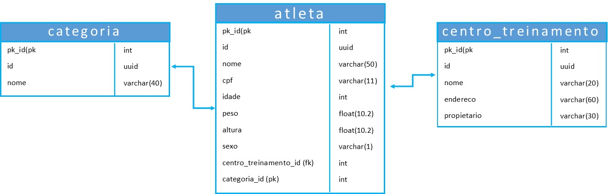

# API Workout



## WorkoutAPI: API para Competições de Crossfit
A WorkoutAPI é uma API RESTful robusta, desenvolvida com FastAPI, projetada para simplificar o gerenciamento de competições de Crossfit. Embora seja um projeto de aprendizado, oferece funcionalidades essenciais para organizar e acompanhar seus eventos, com foco na aplicação prática de desenvolvimento de APIs.

## Principais Recursos
* **Gerenciamento de Atletas:** Cadastre, edite e consulte informações de atletas de forma eficiente.
* **Gerenciamento de Provas (WODs):** Crie, edite e liste provas (WODs), incluindo detalhes como tipo, movimentos e pesos.
* **Registro de Resultados:** Registre e consulte resultados de atletas em cada prova com facilidade.
* **Cálculo de Rankings:** Gere rankings automaticamente com base nos resultados, agilizando o processo.
 
## Tecnologias Utilizadas

* **Banco de Dados:** PostgreSQL (gerenciado com Docker Compose)
* **ORM e Modelagem:** SQLAlchemy, Pydantic, Alembic
* **Framework:** FastAPI
* **Paginação:** fastapi-pagination

<details>
<summary>Como Executar o Projeto</summary>

* **Crie o Banco de Dados:** Utilize Docker Compose para configurar o ambiente do banco de dados

```console
$ docker-compose up -d
```

* **Execute as Migrações:** Aplique as migrações do Alembic para criar o esquema do banco de dados.

```console
$ make run-migrations
```

```console
$ make create-migrations -d "nome_da_migration"
```

* **Inicie o Servidor:** Execute o servidor FastAPI para que a API fique disponível.

```console
$ make run
```
</details>
<details>
<summary>Modelagem de Entidades e Relacionamentos (MER)</summary>


</details>
<details>
<summary>Parâmetros de consulta nos endpoints</summary>

      - atleta
            - nome
            - cpf

* Adição no arquivo atleta/controller.py. 
* É necessário fornecer **nome e CPF** para a consulta.

```python
@router.get(
        path='/nome={nome}', 
        summary='consultar um atleta pelo nome',
        status_code = status.HTTP_200_OK,
        response_model= AtletaOut,
        ) 


async def query(nome: str, db_session: DatabaseDependency, cpf: str | None = None) -> AtletaOut:
    atleta: AtletaOut = (
    await db_session.execute(select(AtletaModel).filter_by(nome=nome, cpf=cpf))
        ).scalars().first()
     
    if not atleta:
        raise HTTPException(
            status_code = status.HTTP_404_NOT_FOUND, 
            detail= f'Atleta não encontrado com nome: {nome}'
            )
    
    return atleta
```
</details>
<details>
<summary>Consultas Personalizadas</summary>

* **Atletas:** Consulte por nome e CPF.

      - get all
            - atleta
                  - nome
                  - centro_treinamento
                  - categoria


```python
class AtletaResponse(BaseSchema):
    nome: Annotated[str, Field(description='Nome do Atleta', example='Joao', max_length=50)]
    categoria: Annotated[CategoriaIn, Field(description='Categoria do Atleta')]
    centro_treinamento: Annotated[CentroTreinamentoAtleta, Field(description='Centro de treinamento do Atleta')]
```

* **Respostas Personalizadas:** Utilize schemas personalizados para adaptar as respostas da API.

```python
@router.get(
        path='/all_atletas', 
        summary='consulta personalizada todos os atletas',
        status_code = status.HTTP_200_OK,
        response_model= list[AtletaResponse],
        ) 


async def query(db_session: DatabaseDependency) -> list[AtletaResponse]:
    atletas: list[AtletaResponse] = (await db_session.execute(select(AtletaModel))).scalars().all()

    return [AtletaResponse.model_validate(atleta) for atleta in atletas]
```
</details>
<details>
<summary>Tratamento de Exceções</summary>

* **Integridade de Dados:** A API trata exceções como sqlalchemy.exc.IntegrityError para garantir a integridade dos dados, retornando mensagens claras e códigos de status apropriados (303).

```python
    await db_session.commit()
    except IntegrityError:
        raise HTTPException(
            status_code=status.HTTP_303_SEE_OTHER,
            detail=f'Já existe um atleta cadastrado com o cpf: {atleta_in.cpf}'
        )
```
**O arquivo controller.py para categorias e centro de treinamento segue a mesma estrutura, utilizando o "Nome" como identificador único em vez do CPF.**

</details>
<details>
<summary>Paginação de Resultados</summary>

* A API utiliza a biblioteca fastapi-pagination para implementar paginação de resultados, permitindo consultas eficientes com parâmetros limit e offset.

```python
add_pagination(app)
```


```python
@router.get(
        path='/', 
        summary='consultar todos os atletas',
        status_code = status.HTTP_200_OK,
        response_model= LimitOffsetPage[AtletaOut],
        ) 


async def query(db_session: DatabaseDependency):
    
    return await paginate(db_session, select(AtletaModel))
```
</details>

### **Contribuições são bem-vindas!** Sinta-se à vontade para abrir issues ou pull requests.