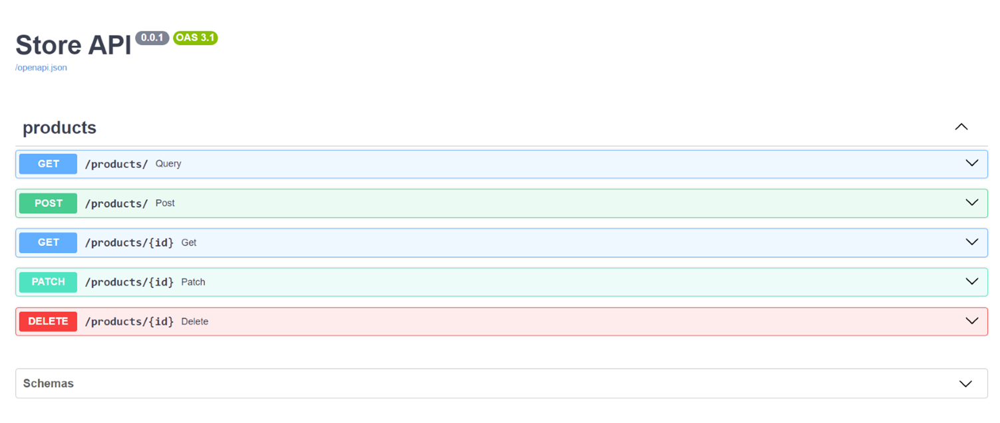
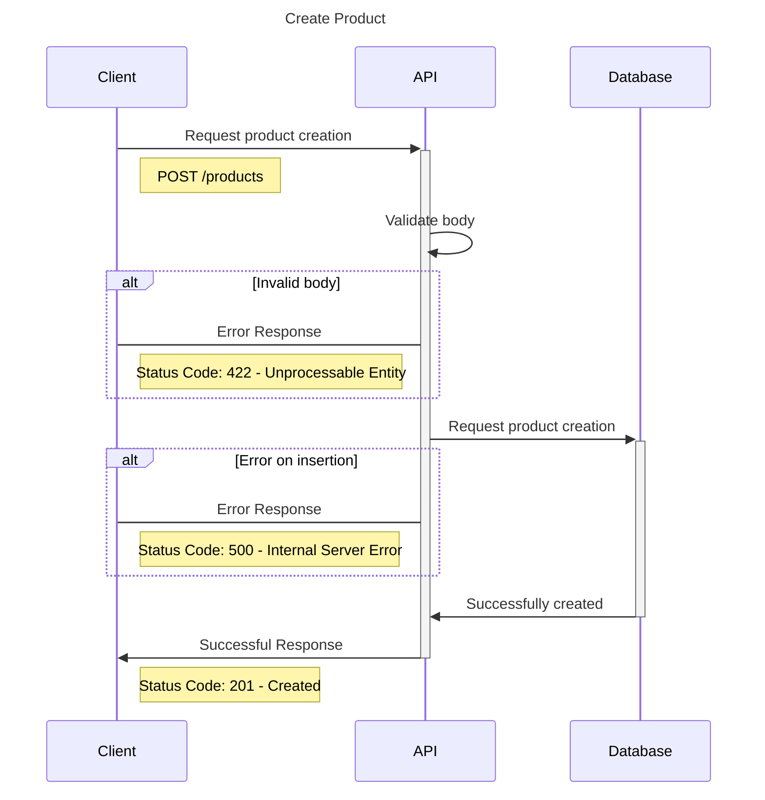
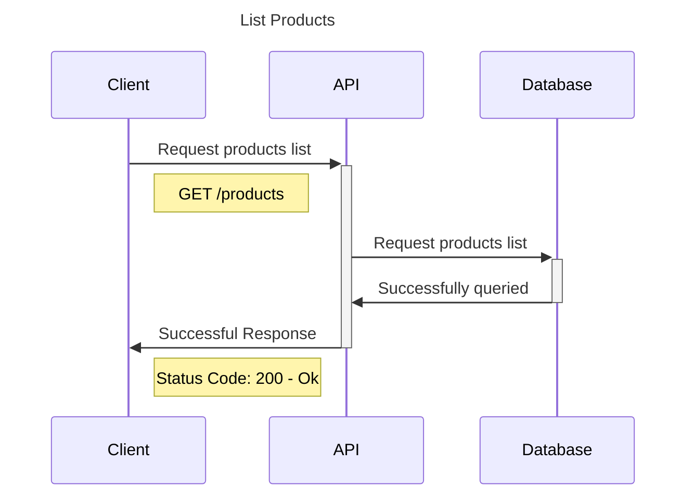
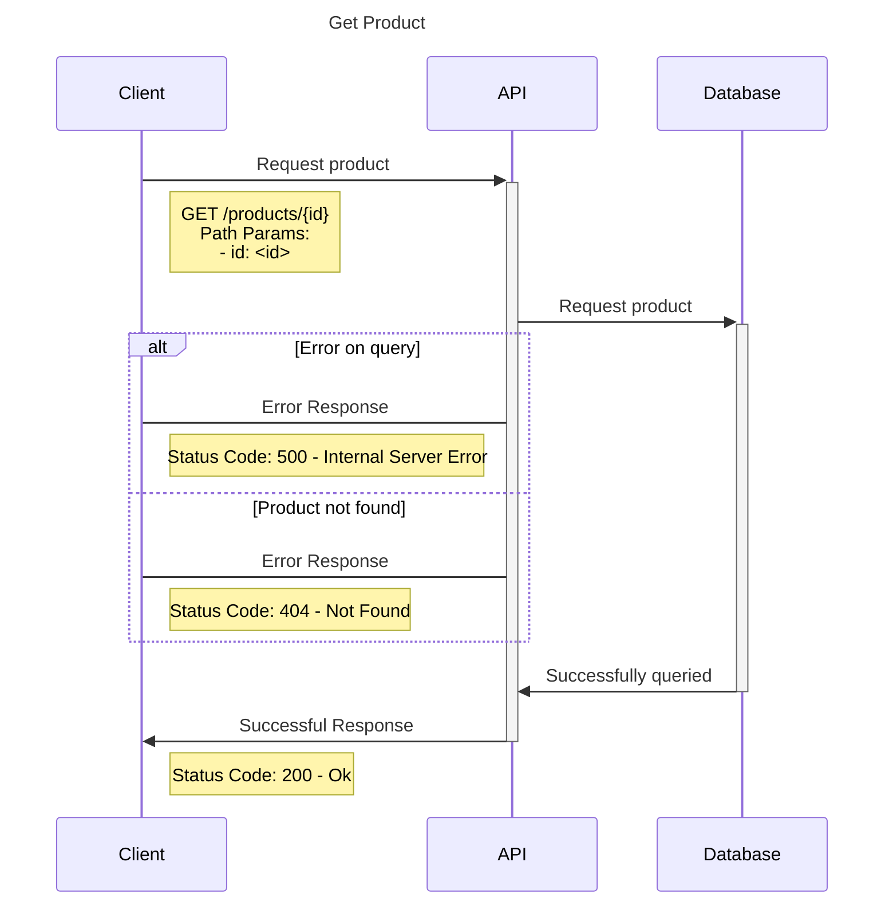
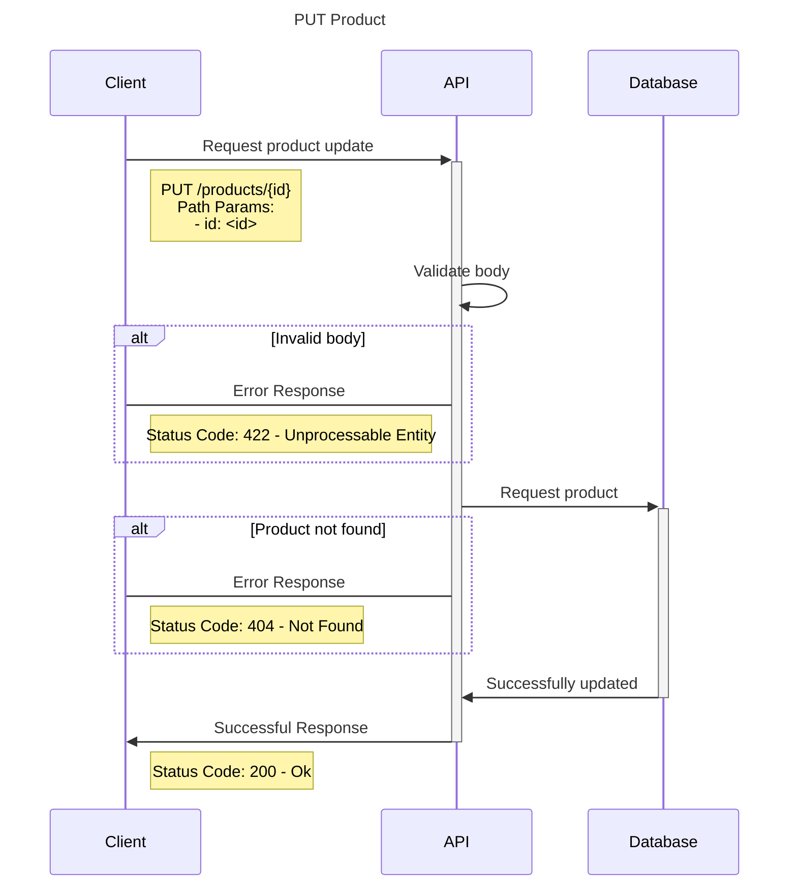
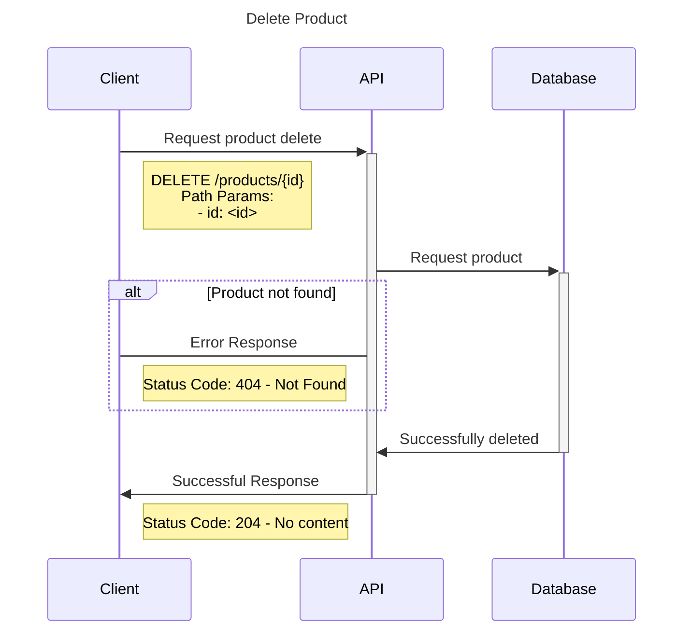

# Projeto TDD: Construindo uma API com FastAPI e Testes com Pytest

O que é TDD (Test Driven Development)?

TDD, ou Desenvolvimento Orientado a Testes, é uma abordagem de desenvolvimento de software que prioriza a criação de testes antes da implementação do código. Essa metodologia promove ciclos de desenvolvimento mais curtos e garante uma maior qualidade do software

### Ciclo do TDD

### Vantagens do TDD
* **Software de alta qualidade:** A aplicação é construída com foco na qualidade desde o início.
* **Identificação de falhas:** Os testes ajudam a encontrar e corrigir erros precocemente.
* **Testes abrangentes:** Criação de testes unitários, de integração e outros tipos de testes.
* **Código conciso e eficiente:** Evita a criação de código desnecessário ou complexo.
* **Requisitos bem definidos:** Garante que o código atenda aos requisitos estabelecidos.

Store API: Um projeto de aprendizado prático

### Resumo do projeto
Este projeto tem como objetivo demonstrar a aplicação do TDD na prática, através do desenvolvimento de uma API RESTful utilizando o framework FastAPI. A API interage com um banco de dados MongoDB e utiliza o Pydantic para validação de dados. Os testes são implementados com o Pytest.

### Objetivo
O principal objetivo deste projeto é proporcionar um ambiente de aprendizado prático sobre TDD, utilizando tecnologias modernas como FastAPI e Pytest.

### O que a API faz
* **Fins educativos:** A API foi criada para fins de aprendizado e demonstração.
Aprendizado prático: Permite que você aprenda TDD de forma prática, construindo uma API completa.

### O que a API NÃO faz
* **Comunicação externa:** A API não se integra com outras aplicações externas.

### Solução Proposta
Desenvolvimento de uma API simples, seguindo os princípios do TDD, com testes abrangentes utilizando o Pytest. Os testes incluem validação de schemas, casos de uso e testes de integração dos controladores.

### Arquitetura
||
|:--:|
| Diagrama de C4 da Store API |

### Banco de dados - MongoDB
||
|:--:|
| Database - Store API |

Diagramas de sequência para o módulo de Produtos

### Diagrama de criação de produto

### Diagrama de listagem de produtos

### Diagrama de detalhamento de um produto

### Diagrama de atualização de produto

### Diagrama de exclusão de produto

